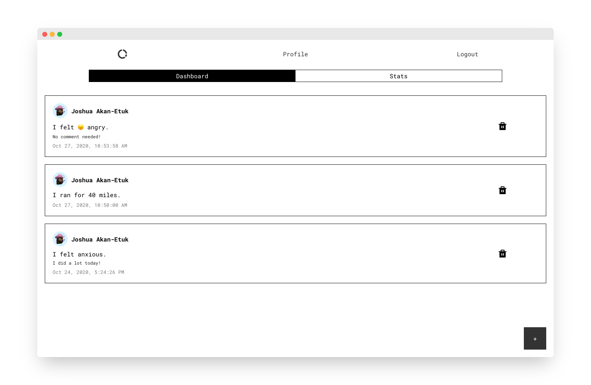

# Atomic

 
<a href="https://atomic.joshuaakanetuk.com">Live App</a>  📜 Keep a running log of your activities and feelings! For data junkies and folks looking to make changes in their life.

## Motivation

Inspired by Productive, Daylio, and countless other apps telling me what to do instead of measuring what I routinely do already. 

## Features

- Sign up.
- Customize your profile image.
- Create cells (feeling and activity logs) for your day.
- Get a summary of your feelings and activities. 
- Responsive design.

## Tech Stack

- HTML
- CSS
- Javascript
- React
- PostgreSQL
- Express

## Installation & Development 

You'll need `atomic-server` to be active and running before starting this repo.

- Clone from [`https://github.com/joshuaakanetuk/atomic`](https://github.com/joshuaakanetuk/atomic)
- `cd` into `atomic`
- Run `npm i` 
- Run `npm run dev`

## Copyright
Copyright 2020, Joshua Akan-Etuk. 

 

